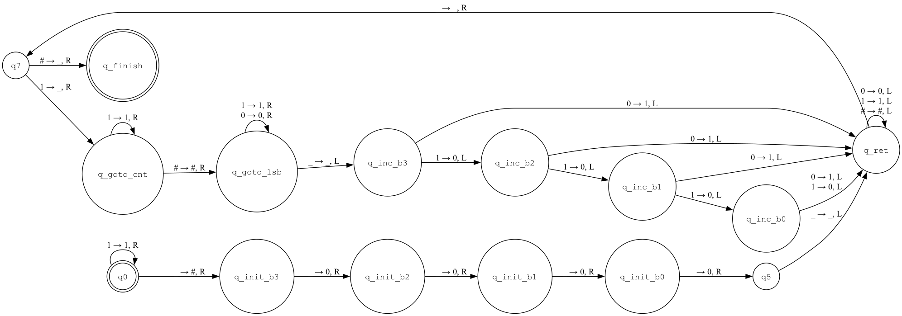

# První semestrální úkol

## Zadání 1. semestrálního úkolu

Zkonstruujte Turingův stroj, počítající délku úseku

Konkrétně: Turingův stroj pracuje se vstupní abecedou   ∑ = { 0, 1 } . Na začátku výpočtu je na pásce řada symbolů "1", dlouhá 0 až 15 symbolů. Hlava na začátku je na prvním - nejlevějším z nich (protože připouštíme i řadu délky 0, může to být i prázdné políčko). Turingův stroj tyto řadu postupně vymaže a na konci činnosti budou na pásce čtyři symboly "0" či "1", čtyřbitové binární číslo reprezentující délku původní řady jedniček. Přitom nejvýznamnější bit bude nalevo, nejméně významný napravo. 

## Řešení

### Stavový diagram



Počet stavů: 15

### Kód Turingova stroje

Použit následující emulátor Turingova stroje: [Turing Machine Simulator](https://alistat.eu/online/turingmachinesimulator)

```
initial q0,
accept q_finish,

q0 1 q0 1 r,
q0 _ q_init_b3 # r,

q_init_b3 _ q_init_b2 0 r,
q_init_b2 _ q_init_b1 0 r,
q_init_b1 _ q_init_b0 0 r,
q_init_b0 _ q5 0 r,

q5 _ q_ret _ l,

q_ret 0 q_ret 0 l,
q_ret 1 q_ret 1 l,
q_ret # q_ret # l,
q_ret _ q7 _ r,

q7 # q_finish _ r,
q7 1 q_goto_cnt _ r,

q_goto_cnt 1 q_goto_cnt 1 r,
q_goto_cnt # q_goto_lsb # r,

q_goto_lsb 1 q_goto_lsb 1 r,
q_goto_lsb 0 q_goto_lsb 0 r,
q_goto_lsb _ q_inc_b3 _ l,


q_inc_b3 0 q_ret 1 l,
q_inc_b3 1 q_inc_b2 0 l,

q_inc_b2 0 q_ret 1 l,
q_inc_b2 1 q_inc_b1 0 l,

q_inc_b1 0 q_ret 1 l,
q_inc_b1 1 q_inc_b0 0 l,

q_inc_b0 0 q_ret 1 l,
q_inc_b0 1 q_ret 0 l,
```